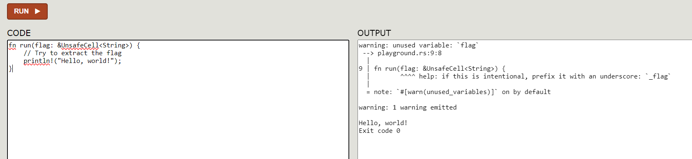

# Blazingly fast

## Description

They say Rust is a memory-safe language, which means that code that avoids unsafe can’t perform an insecure operation. This seems to indicate forbidding unsafe turns Rust into a safe sandbox, doesn’t it?

<https://awolfinunix.q.2024.ugractf.ru/slt8nzbmv1va8aqr>

Challenge by purplesyringa.

## Solution



```rust
fn run(flag: &UnsafeCell<String>) {
    // Try to extract the flag
    println!("{0}", flag);
}
```

```text
error[E0277]: `UnsafeCell<String>` doesn't implement `std::fmt::Display`
  --> playground.rs:11:21
   |
11 |     println!("{0}", flag);
   |                     ^^^^ `UnsafeCell<String>` cannot be formatted with the default formatter
   |
   = help: the trait `std::fmt::Display` is not implemented for `UnsafeCell<String>`
   = note: in format strings you may be able to use `{:?}` (or {:#?} for pretty-print) instead
   = note: this error originates in the macro `$crate::format_args_nl` which comes from the expansion of the macro `println` (in Nightly builds, run with -Z macro-backtrace for more info)

error: aborting due to 1 previous error

For more information about this error, try `rustc --explain E0277`.
Exit code 0
```

